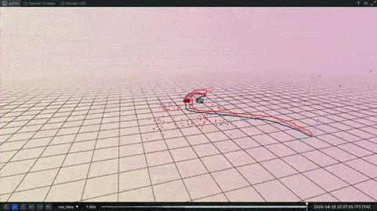
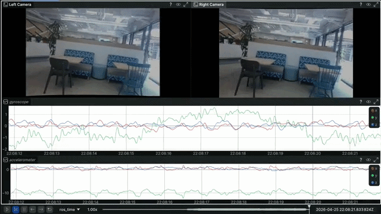
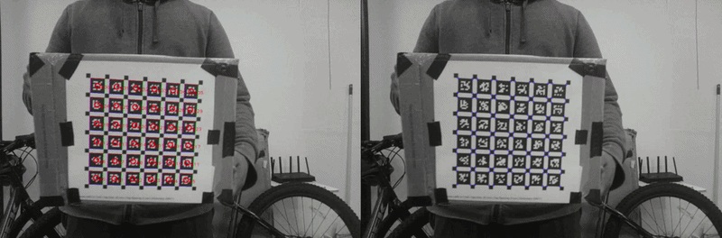
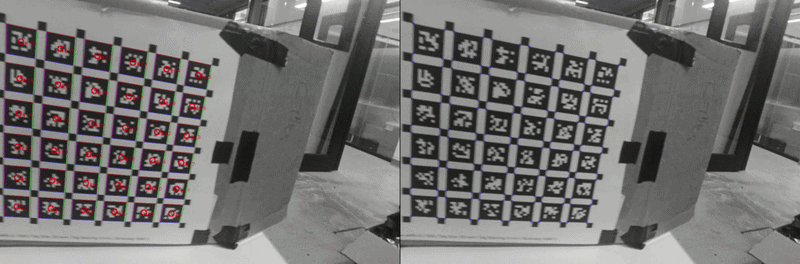
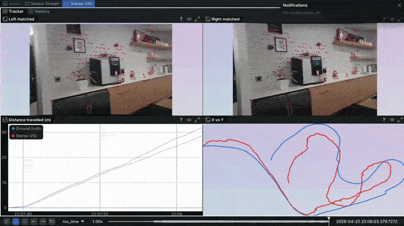
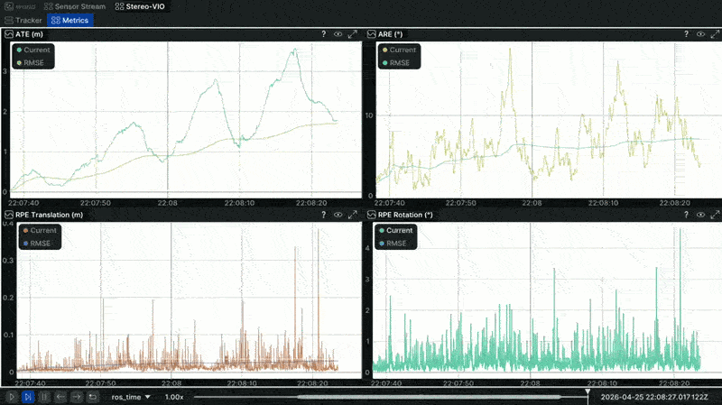

# SLAM Project

<p align="center">
  <a href="https://www.ros.org/">
    
  </a>
  <a href="https://huggingface.co/datasets/OmniInstrument/SLAM_project">
    
  </a>
  <a href="https://rerun.io/">
    
  </a>
</p>

<div align="justify">
This project provides a minimal stereo-inertial SLAM pipeline with <a href="https://github.com/ethz-asl/kalibr">Kalibr</a>-based calibration and ROS 2 VIO evaluation. The datasets, Docker environments, baseline <a href="ros2_ws/src/stereo_vio"><code>stereo_vio</code></a> package, visualization, and odometry metrics are already implemented.<br><br>

Your task is to reduce the VIO trajectory error.<br>

The system will:
- Provide stereo and stereo-inertial calibration data
- Run <a href="https://github.com/ethz-asl/kalibr">Kalibr</a> inside a ROS 1 environment
- Run the baseline stereo-inertial VIO pipeline in ROS 2
- Compare the estimated trajectory against ground truth
- Report ATE, ARE, and RPE metrics

You first calibrate the stereo-inertial system with <a href="https://github.com/ethz-asl/kalibr">Kalibr</a>, then use that calibration to improve <a href="ros2_ws/src/stereo_vio"><code>stereo_vio</code></a>. Keep the implementation clean, correct, and deterministic.
</div>

<table width="100%">
  <tr>
    <td align="center" width="50%">
      <br>
      <strong>VIO</strong><br>
      <sub>$$\color{blue}Blue$$ = Ground truth | $$\color{red}Red$$ = Estimated</sub>
    </td>
    <td align="center" width="50%">
      <br>
      <strong>Sensor Data</strong>
    </td>
  </tr>
</table>

## Dependencies
A Linux Ubuntu computer, or other equivalent.

You only need to install [Docker](https://docs.docker.com/engine/install/ubuntu/) and follow [Linux Post-Installation](https://docs.docker.com/engine/install/linux-postinstall/) to get started.

<details>
  <summary><strong>GPU Support (Optional)</strong></summary>

If your system includes an NVIDIA GPU, you can enable GPU acceleration inside Docker.

**Install:**
- [NVIDIA GPU drivers](https://www.nvidia.com/en-us/drivers/)
- [NVIDIA Container Toolkit](https://docs.nvidia.com/datacenter/cloud-native/container-toolkit/latest/install-guide.html)
</details>

## Cyclone DDS tuning

The Linux kernel must be optimized to use large packet sizes. This can be done using the script provided and is done outside docker.

```shell
cd usb_dds_setup && bash install_ipfrag.sh
```

> [!NOTE]
> You need `sudo` to change this.

You can refer to further documentation [here](https://autowarefoundation.github.io/autoware-documentation/main/installation/additional-settings-for-developers/network-configuration/dds-settings/) or [here](https://docs.ros.org/en/jazzy/How-To-Guides/DDS-tuning.html).

## Getting Started
Clone the repo

```shell
git clone --recursive https://github.com/omniinstrument/SLAM_project.git
```

Start the Kalibr environment

```shell
bash scripts/start.sh ros1
```

Start the VIO environment

```shell
bash scripts/start.sh ros2
```

> [!NOTE]
> The start script builds the Docker images, downloads the datasets from Hugging Face, and builds the ROS workspace. Dataset download occurs only once.

> [!NOTE]
> To override the Docker base image, pass `ROS1_ROOT_IMAGE` or `ROS2_ROOT_IMAGE` when starting the environment:
> ```shell
> ROS1_ROOT_IMAGE=ubuntu:20.04 bash scripts/start.sh ros1
> ROS2_ROOT_IMAGE=ubuntu:24.04 bash scripts/start.sh ros2
> ```

## Calibration
<table width="100%">
  <tr>
    <td align="center" width="50%">
      <br>
      <strong>Stereo camera calibration</strong>
    </td>
    <td align="center" width="50%">
      <br>
      <strong>Stereo-inertial calibration</strong>
    </td>
  </tr>
</table>

Use [Kalibr](https://github.com/ethz-asl/kalibr) in the ROS 1 container to estimate:

- Stereo camera intrinsics
- Stereo extrinsics
- Camera-IMU extrinsics
- Camera-IMU time offset, if useful

Before running [Kalibr](https://github.com/ethz-asl/kalibr), update [aprilgrid.yaml](config/aprilgrid.yaml) with the correct [target parameters](https://huggingface.co/datasets/OmniInstrument/SLAM_project). Use the `pinhole-radtan` camera model for both cameras.

The provided [imu.yaml](config/imu.yaml) file is required for stereo-inertial calibration.

Use the calibration result to update the VIO calibration consumed by [calib.yaml](ros2_ws/src/stereo_vio/config/calib.yaml).

> [!NOTE]
> Refer to the [Kalibr documentation](https://github.com/ethz-asl/kalibr/wiki) for calibration commands and configuration details.

## VIO
Run the ROS 2 VIO pipeline:

```shell
ros2 launch stereo_vio stereo_vio.launch.py
```

<table width="100%">
  <tr>
    <td align="center" width="50%">
      <br>
      <strong>Tracking</strong><br>
      <sub>$$\color{blue}Blue$$ = Ground truth | $$\color{red}Red$$ = Estimated</sub>
    </td>
    <td align="center" width="50%">
      <br>
      <strong>Trajectory metrics</strong><br>
    </td>
  </tr>
</table>

The launch file runs the VIO pipeline, visualization, and trajectory-error computation, then closes automatically shortly after bag playback finishes.

Your final VIO estimate must be published on `/stereo_vio/odom` (`nav_msgs/Odometry`) topic for evaluation.

> [!NOTE]
> The final report is saved in the [output](output) folder as `stereo_vio_odometry_error.txt`.

> [!WARNING]
> Incase you get an error like `ros2: failed to increase socket receive buffer size to at least 33554432 bytes, current is 425984 bytes` that means you Linux kernel is not tuned for large packets. Refer to [Cyclone DDS tuning](#cyclone-dds-tuning)

> [!NOTE]
> For GUI layout changes, save the Rerun blueprint to [rerun_wrapper.rbl](ros2_ws/src/rerun_wrapper/template/rerun_wrapper.rbl).

## Instructions
- You are free to improve [stereo_vio](ros2_ws/src/stereo_vio) using any classical, optimization-based, learning-based, or hybrid method.
- You are free to use external libraries.
- You are free to use AI code editors or AI agents, your code can be 100% AI generated.
- You are free to use any programming language, including Python, C++, Rust, and/or CUDA.
- **You are not allowed to modify the odometry error computation or report generation in [odometry_error_node.hpp](ros2_ws/src/stereo_vio/include/stereo_vio/odometry_error_node.hpp) or [odometry_error_node.cpp](ros2_ws/src/stereo_vio/src/odometry_error_node.cpp).**

### Submission
Upload the [output](output) directory and share it with us.

Also include a brief summary of:
- The calibration files used
- The [stereo_vio](ros2_ws/src/stereo_vio) changes made

## Bugs/Support
If you come across any bugs or have questions, feel free to open an Issue or reach out to [Jagennath Hari](mailto:hari@omniinstrument.com).

## License
This software and dataset are released under the [MIT License](LICENSE).

## Acknowledgment
This work integrates several powerful research papers, libraries, and open-source tools:

- [**Kalibr**](https://github.com/ethz-asl/kalibr)
- [**GTSAM**](https://gtsam.org/)
- [**Rerun**](https://rerun.io/)
